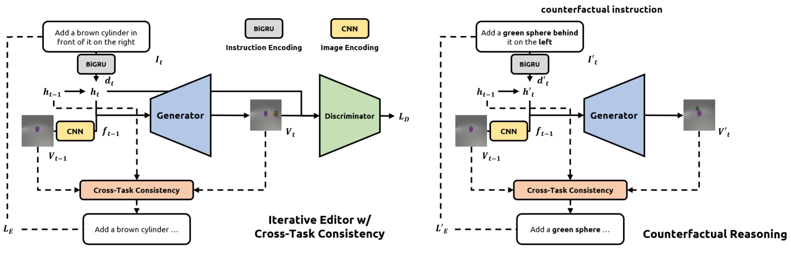

# [EMNLP'20 (Long)] SSCR: Iterative Language-Based Image Editing via Self-Supervised Counterfactual Reasoning
A **PyTorch** implementation of SSCR

[Paper](https://tsujuifu.github.io/pubs/emnlp20_sscr.pdf) | [Slide](https://tsujuifu.github.io/slides/emnlp20_sscr.pdf)


## Overview
SSCR is an implementation of <br> 
"[SSCR: Iterative Language-Based Image Editing via Self-Supervised Counterfactual Reasoning](https://tsujuifu.github.io/pubs/emnlp20_sscr.pdf)" <br>
[Tsu-Jui Fu](https://tsujuifu.github.io/), [Xin Eric Wang](https://eric-xw.github.io/), [Scott Grafton](https://labs.psych.ucsb.edu/grafton/scott/), [Miguel Eckstein](https://viu.psych.ucsb.edu/), and [William Yang Wang](https://sites.cs.ucsb.edu/~william/) <br>
in Conference on Empirical Methods in Natural Language Processing (**EMNLP**) 2020 (long)



The iterative editor is a conditional generator that modifies an image based on current instruction and editing history. Counterfactual reasoning allows the model to think about the expected, resulting images under various counterfactual instructions. In this way, the editor can **consider more diverse instructions than the original data to improve the generalizability**, even if under data scarcity. With the help of this cross-task matching, we can **not only provide a detailed token-level training signal to train the editor better but also supply training loss for counterfactual reasoning in a selfsupervised scenario**.

## Requirements
This code is implemented under **Python3** and [PyTorch](https://pytorch.org). <br>
Following libraries are also required:
+ [PyTorch](https://pytorch.org) >= 1.2
+ [Visdom](https://github.com/facebookresearch/visdom)

## Usage

+ Dataset:
    + Follow [GeNeVA](https://github.com/Maluuba/GeNeVA_datasets/) or download pre-processed [here](https://drive.google.com/file/d/1EnZx0hqrsLAjYq4EdbHb-JJ_qE-Vgy8k/view?usp=sharing).
+ Run Vidsom
```
visdom
```
+ [Train](sscr/geneva/inference/train.py)
```
python -m geneva.inference.train @example_args/iclevr-d-subtract.args
```
+ [Test](sscr/geneva/inference/test.py)
 ```
 python -m geneva.inference.test @example_args/iclevr-d-subtract.args
 ```
 + [Trained Models](https://drive.google.com/drive/folders/1DvmEmqTaDjZA0Fea1MfW7A0Kz2fjf8g9?usp=sharing)
     + Edit "--load_snapshot" in [args](sscr/example_args/iclevr-d-subtract.args)

## Resources
+ [GeNeVA](https://github.com/Maluuba/GeNeVA)
+ [This project](https://drive.google.com/drive/folders/1DvmEmqTaDjZA0Fea1MfW7A0Kz2fjf8g9?usp=sharing)

## Citation
```
@inproceedings{fu2020sscr, 
  author = {Tsu-Jui Fu and Xin Eric Wang and Scott Grafton and Miguel Eckstein and William Yang Wang}, 
  title = {SSCR: Iterative Language-Based Image Editing via Self-Supervised Counterfactual Reasoning}, 
  booktitle = {Conference on Empirical Methods in Natural Language Processing (EMNLP)}, 
  year = {2020} 
}
```
